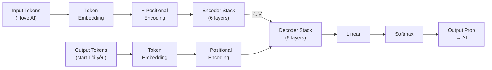
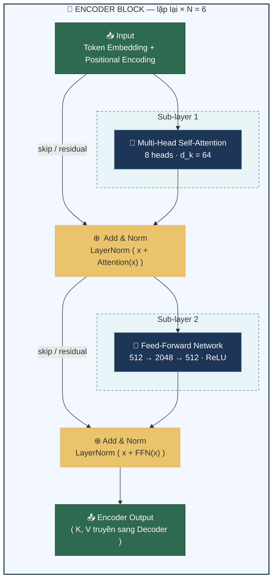
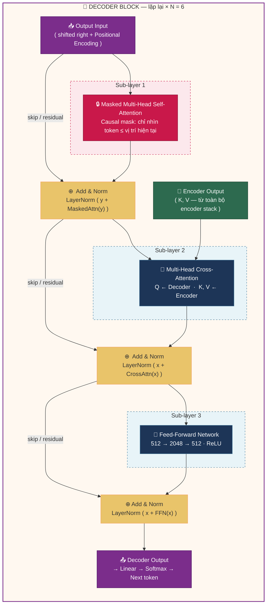
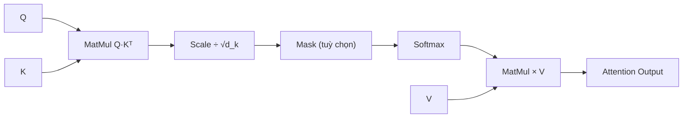
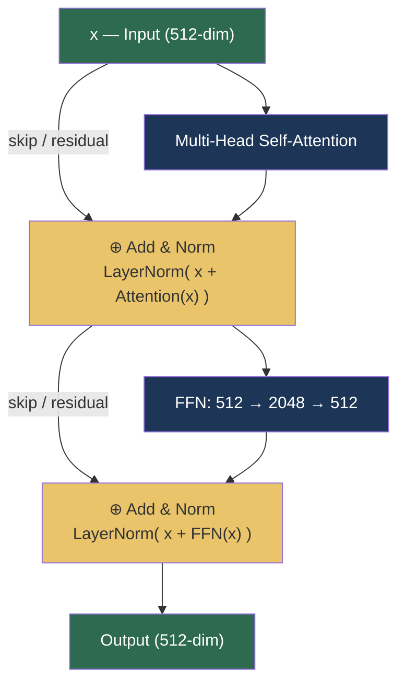
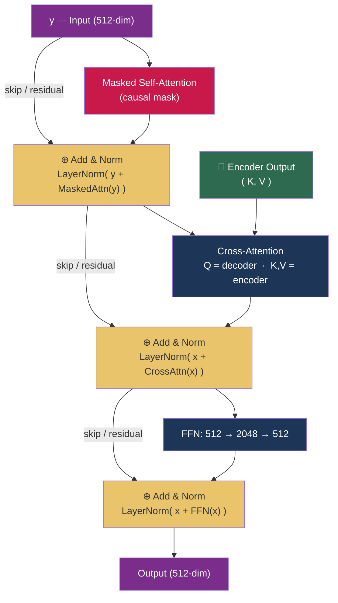
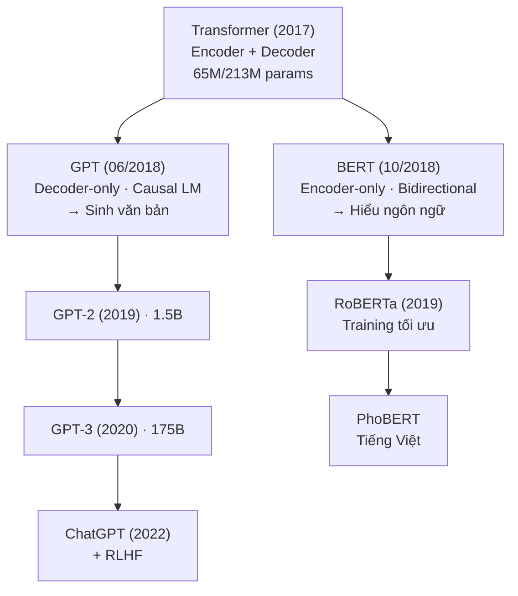
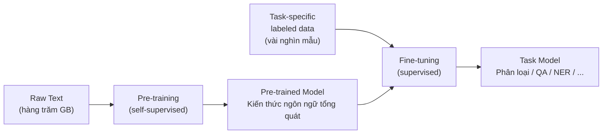
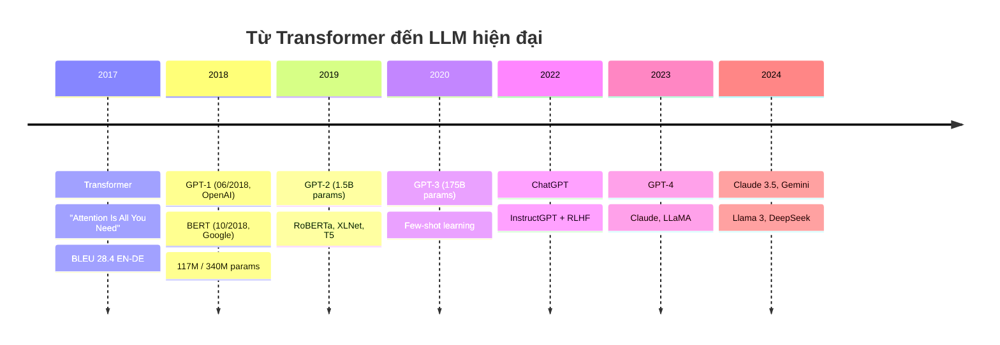

<div align="center">

---

# 🤖 TRANSFORMER
## Giải Thích Chi Tiết Từ Bài Báo Gốc Đến BERT & GPT

---

> *"Attention Is All You Need"*
> **Vaswani et al. · Google Brain · NeurIPS 2017**

---

</div>

> 📖 **Bài giảng toàn diện** về kiến trúc Transformer — từ động cơ ra đời, kiến trúc Encoder-Decoder, cơ chế Self-Attention, Positional Encoding, đến quá trình huấn luyện và kết quả thực nghiệm. Mở rộng sang GPT và BERT — hai "hậu duệ" đã thay đổi hoàn toàn ngành AI.

Năm 2017, 8 nhà nghiên cứu tại Google công bố bài báo với cái tên đầy tham vọng — **"Attention Is All You Need"**. Vào thời điểm ấy, ít ai ngờ rằng kiến trúc được giới thiệu trong bài báo đó — **Transformer** — sẽ trở thành nền móng cho gần như toàn bộ cuộc cách mạng AI sau này: từ Google dịch, BERT trong cỗ máy tìm kiếm Google, cho tới GPT, Claude, Gemini và ChatGPT mà chúng ta dùng hằng ngày.

Bài viết này sẽ đi qua **toàn bộ nội dung của bài báo gốc** — từng công thức, từng con số, từng bảng ablation — rồi mở rộng sang hai "hậu duệ" nổi tiếng nhất: **GPT** (decoder-only) của OpenAI và **BERT** (encoder-only) của Google. Mục tiêu là khi đọc xong, bạn không chỉ *biết* Transformer là gì, mà còn *hiểu* vì sao scale bằng $\sqrt{d_k}$, vì sao dùng sin-cos cho positional encoding, vì sao multi-head attention quan trọng, và vì sao BERT hiểu ngôn ngữ tốt hơn GPT nhưng GPT lại sinh văn bản giỏi hơn.

Bài viết được viết cho **người mới bắt đầu** — không yêu cầu kiến thức sâu về deep learning. Mọi khái niệm đều được giải thích từ trực giác, kèm ví dụ cụ thể và tính toán thủ công trước khi đưa ra công thức tổng quát.

---

## Mục lục

1. [Bối cảnh: Khi RNN chạm trần giới hạn](#1-bối-cảnh-khi-rnn-chạm-trần-giới-hạn)
2. [Transformer là gì? Từ "đọc tuần tự" sang "nhìn toàn cục"](#2-transformer-là-gì)
3. [Kiến trúc tổng thể: Encoder – Decoder](#3-kiến-trúc-tổng-thể-encoder--decoder)
4. [Tokenization và Embedding: Biến chữ thành số](#4-tokenization-và-embedding)
5. [Positional Encoding: Dạy Transformer biết thứ tự](#5-positional-encoding)
6. [Self-Attention: Trái tim của Transformer](#6-self-attention)
7. [Multi-Head Attention: Nhìn từ nhiều góc độ](#7-multi-head-attention)
8. [Feed-Forward Network, Residual Connection và Layer Normalization](#8-feed-forward-network-residual-và-layer-norm)
9. [Tại sao Self-Attention? So sánh với RNN và CNN](#9-tại-sao-self-attention)
10. [Huấn luyện Transformer](#10-huấn-luyện-transformer)
11. [Kết quả thực nghiệm](#11-kết-quả-thực-nghiệm)
12. [Từ Transformer đến Pre-trained Language Models](#12-từ-transformer-đến-pre-trained-language-models)
13. [GPT — Decoder-Only: Nghệ thuật sinh văn bản](#13-gpt--decoder-only)
14. [BERT — Encoder-Only: Bậc thầy hiểu ngôn ngữ](#14-bert--encoder-only)
15. [So sánh tổng hợp và dòng thời gian tiến hoá](#15-so-sánh-và-timeline)
16. [Kết luận](#16-kết-luận)
17. [Tài liệu tham khảo](#17-tài-liệu-tham-khảo)

---

## 1. Bối cảnh: Khi RNN chạm trần giới hạn

Trước năm 2017, gần như mọi bài toán xử lý chuỗi — dịch máy, tóm tắt văn bản, chatbot — đều dựa vào **RNN (Recurrent Neural Network)** và các biến thể cải tiến như **LSTM** (Long Short-Term Memory) và **GRU** (Gated Recurrent Unit).

### Cách RNN hoạt động

RNN xử lý dữ liệu theo **trình tự thời gian**: token sau chỉ được xử lý sau khi token trước hoàn thành. Tại mỗi bước thời gian *t*, mô hình tính:

$$h_t = f(h_{t-1}, x_t)$$

Nghĩa là trạng thái ẩn $h_t$ phụ thuộc vào trạng thái trước đó $h_{t-1}$ và input hiện tại $x_t$. Thông tin được "truyền tay" từ đầu câu đến cuối câu qua chuỗi hidden state.


### Ba giới hạn cốt lõi của RNN

**Thứ nhất: Không thể song song hoá.** Vì $h_t$ phải chờ $h_{t-1}$, nên dù bạn có hàng nghìn GPU, RNN vẫn phải xử lý từng token một. Với câu 100 từ, cần 100 bước tuần tự — không tận dụng được sức mạnh phần cứng hiện đại.

**Thứ hai: Vanishing Gradient.** Khi chuỗi dài, gradient truyền ngược qua hàng trăm bước bị "tiêu biến" dần. LSTM và GRU giảm nhẹ vấn đề này bằng cơ chế gate, nhưng không giải quyết triệt để.

**Thứ ba: Học kém quan hệ xa (long-range dependency).** Hãy xem câu:

> *"The animal didn't cross the street because **it** was too tired."*

Để hiểu "it" ám chỉ "animal" (chứ không phải "street"), mô hình cần liên kết hai từ cách nhau 6 vị trí. Với RNN, thông tin về "animal" phải đi qua 6 hidden state trung gian — mỗi bước đều có nguy cơ bị suy hao. Câu càng dài, vấn đề càng nghiêm trọng.

### Attention ban đầu: Giải pháp "vá lỗi" cho RNN

Năm 2014, Bahdanau et al. đề xuất **cơ chế Attention** để cải thiện seq2seq: thay vì ép toàn bộ câu nguồn vào một vector duy nhất, decoder có thể "nhìn lại" từng hidden state của encoder và tập trung vào phần liên quan nhất.

Tuy nhiên, attention lúc này chỉ là **phụ kiện** cho RNN — backbone vẫn là recurrence tuần tự. Đến năm 2017, nhóm nghiên cứu tại Google đặt câu hỏi: *Nếu attention hiệu quả đến vậy, tại sao không dùng attention làm toàn bộ kiến trúc, bỏ hẳn recurrence?*

Và Transformer ra đời.

### So sánh trực quan RNN vs Transformer

Để hiểu rõ sự khác biệt, hãy xem cách hai kiến trúc xử lý câu "The cat sat on the mat":

**RNN:** Phải xử lý tuần tự 6 bước. Khi đến token "mat" (bước 6), thông tin về "The" (bước 1) đã đi qua 5 hidden state trung gian — mỗi bước đều có nguy cơ thông tin bị suy hao hoặc biến dạng. Trên GPU, 6 bước này **không thể chạy song song** vì bước sau phụ thuộc bước trước.

**Transformer:** Xử lý cả 6 token **cùng lúc** trong một phép tính ma trận. Token "mat" trực tiếp "nhìn thấy" token "The" qua cơ chế attention — khoảng cách chỉ là **1 phép tính**, không phụ thuộc vào câu dài hay ngắn. Trên GPU, toàn bộ tính toán **hoàn toàn song song**.

Sự khác biệt này giải thích tại sao Transformer có thể train nhanh hơn RNN nhiều lần trên cùng phần cứng, đặc biệt với câu dài.

---

## 2. Transformer là gì?

Transformer là kiến trúc neural network được giới thiệu trong bài báo **"Attention Is All You Need"** (Vaswani et al., 2017) tại hội nghị NeurIPS. Bài báo do 8 nhà nghiên cứu từ Google Brain, Google Research và University of Toronto đồng tác giả — và mỗi người đóng góp một mảnh ghép quan trọng:

- **Jakob Uszkoreit** đề xuất ý tưởng thay RNN bằng self-attention
- **Ashish Vaswani** và **Illia Polosukhin** thiết kế và implement Transformer đầu tiên
- **Noam Shazeer** đề xuất scaled dot-product attention và multi-head attention
- **Niki Parmar** thực nghiệm và tinh chỉnh vô số biến thể
- **Llion Jones** phụ trách codebase ban đầu và attention visualization
- **Łukasz Kaiser** và **Aidan Gomez** xây dựng tensor2tensor framework

Thông điệp cốt lõi nằm ngay trong tên bài báo:

> *Nếu mô hình biết cách tập trung đúng chỗ (attention), thì recurrence không còn cần thiết.*

Tính đến nay, bài báo có hơn **130.000 lượt trích dẫn** — là một trong những bài báo khoa học được trích dẫn nhiều nhất mọi thời đại.

### Tư duy khác biệt hoàn toàn

RNN hỏi: *"Token này nên được xử lý sau token nào?"* — tức xử lý tuần tự.

Transformer hỏi: *"Token này liên quan đến những token nào, và mức độ liên quan là bao nhiêu?"* — tức xử lý song song, nhìn toàn cục.

Cụ thể, Transformer:
- Nhìn **toàn bộ chuỗi cùng lúc** (không tuần tự)
- Mỗi token **tương tác trực tiếp** với mọi token khác (không cần trung gian)
- Mức độ tương tác được **học tự động** thông qua attention score
- Token đầu câu truy cập trực tiếp token cuối câu trong **một phép tính duy nhất**

Chỉ cần nhìn vào kết quả: Transformer đạt **28.4 BLEU** trên bài dịch Anh-Đức (WMT 2014), vượt mọi mô hình trước đó — kể cả ensemble — với chi phí huấn luyện chỉ bằng **một phần nhỏ**.

---

## 3. Kiến trúc tổng thể: Encoder – Decoder

Trước khi đi vào từng thành phần, hãy nhìn bức tranh toàn cảnh.



*Hình: Luồng dữ liệu toàn bộ Transformer — từ input đến output prediction*


*Hình: Stack 6 Encoder + 6 Decoder của Transformer gốc*

Transformer gồm hai khối chính: **Encoder** (bộ mã hoá) và **Decoder** (bộ giải mã). Đây không phải ý tưởng mới — seq2seq đã có cấu trúc tương tự — nhưng Transformer thay thế hoàn toàn RNN bên trong bằng attention.

### 3.1. Encoder — Bộ máy hiểu ngữ nghĩa

Encoder nhận chuỗi input $(x_1, x_2, ..., x_n)$ và biến nó thành chuỗi biểu diễn liên tục $z = (z_1, z_2, ..., z_n)$. Mỗi $z_i$ là một vector chứa thông tin ngữ nghĩa của token $x_i$ **trong ngữ cảnh toàn bộ câu**.

Encoder gồm **N = 6 layer giống hệt nhau** xếp chồng. Mỗi layer có 2 sub-layer:

1. **Multi-Head Self-Attention**: cho phép mỗi token "nhìn" tất cả token khác trong câu
2. **Position-wise Feed-Forward Network (FFN)**: mạng fully-connected áp dụng độc lập cho từng vị trí

Xung quanh mỗi sub-layer có **residual connection** (kết nối tắt) và **Layer Normalization**:

$$\text{output} = \text{LayerNorm}(x + \text{Sublayer}(x))$$



*Hình: Encoder Block theo Figure 1 — "Attention Is All You Need". Mũi tên "skip / residual" là residual connection.*

Tất cả sub-layer và embedding đều có chiều đầu ra **$d_{model} = 512$** để residual connection hoạt động được (vì phép cộng yêu cầu cùng kích thước).

### 3.2. Decoder — Cỗ máy sinh chuỗi

Decoder sinh chuỗi output $(y_1, y_2, ..., y_m)$ theo kiểu **auto-regressive**: tại mỗi bước, nó dùng các token đã sinh trước đó làm input để dự đoán token tiếp theo.

Decoder cũng có **N = 6 layer**, nhưng mỗi layer có **3 sub-layer**:

1. **Masked Multi-Head Self-Attention**: giống encoder nhưng có **che (mask)** — token tại vị trí $i$ chỉ được nhìn các token $\leq i$, không được "nhìn trước tương lai"
2. **Encoder-Decoder Attention (Cross-Attention)**: Query đến từ decoder, Key và Value đến từ output encoder — cho phép decoder tập trung vào phần input liên quan
3. **Feed-Forward Network**: giống encoder



*Hình: Decoder Block theo Figure 1 — "Attention Is All You Need". Điểm khác biệt: sub-layer 1 có causal mask (🔒), sub-layer 2 nhận K,V từ encoder (cross-attention).*

### 3.3. Ví dụ cụ thể: Dịch "I love AI" → "Tôi yêu AI"

Hãy theo dõi một câu đi qua Transformer:

**Bước 1 — Encoder xử lý input:**
- Input: `["I", "love", "AI"]`
- Mỗi token được embedding thành vector 512 chiều
- Cộng Positional Encoding để biết thứ tự
- Đi qua 6 layer encoder, mỗi layer có self-attention + FFN
- Kết quả: 3 vector $z_1, z_2, z_3$ — mỗi vector chứa thông tin ngữ nghĩa của token đó trong ngữ cảnh toàn câu

**Bước 2 — Decoder sinh output từng token:**
- Bắt đầu với token đặc biệt `<start>`
- Decoder nhìn vào output encoder ($z_1, z_2, z_3$) qua cross-attention
- Dự đoán token đầu tiên: "Tôi"
- Lấy "Tôi" làm input mới, dự đoán tiếp: "yêu"
- Lấy ["Tôi", "yêu"] làm input, dự đoán: "AI"
- Dự đoán `<end>` → dừng

**Chi tiết hơn về luồng dữ liệu trong Decoder:**

Khi decoder dự đoán token thứ 2 ("yêu"), nó thực hiện 3 phép attention theo thứ tự:

1. **Masked Self-Attention:** Input là [`<start>`, "Tôi"]. Token "Tôi" chỉ attend được `<start>` và chính nó (không nhìn token tương lai). Kết quả: vector ngữ cảnh của "Tôi" trong output đã sinh.

2. **Cross-Attention:** Query đến từ kết quả bước 1. Key và Value đến từ output encoder ($z_1, z_2, z_3$ — tương ứng "I", "love", "AI"). Decoder "hỏi" encoder: "Để sinh token tiếp theo sau 'Tôi', tôi cần chú ý phần nào của câu input?" → Attention tập trung vào $z_2$ ("love").

3. **FFN:** Kết quả cross-attention đi qua FFN, đi qua linear + softmax → chọn token "yêu" từ vocabulary.

Quá trình lặp lại cho đến khi sinh token `<end>`.

### 3.4. Ba họ mô hình từ Transformer

Sự linh hoạt của Transformer cho phép tách riêng hoặc kết hợp Encoder/Decoder:

- **Encoder-only** (chỉ dùng Encoder): phù hợp bài toán **hiểu** — phân loại, trích xuất thông tin. Ví dụ: **BERT**
- **Decoder-only** (chỉ dùng Decoder): phù hợp bài toán **sinh** — viết văn bản, chatbot. Ví dụ: **GPT**
- **Encoder-Decoder đầy đủ**: phù hợp bài toán **chuyển đổi chuỗi** — dịch máy, tóm tắt. Ví dụ: **T5**, **Transformer gốc**

---

## 4. Tokenization và Embedding

Trước khi Transformer xử lý được gì, văn bản phải được chuyển thành **số**. Quá trình này gồm hai bước.

### 4.1. Tokenization — Tách văn bản thành đơn vị xử lý

Máy tính không hiểu "từ" — nó chỉ xử lý chuỗi ký hiệu rời rạc. Tokenization chia văn bản thành các **token** mà mô hình có thể xử lý.

Bài báo gốc dùng hai phương pháp:
- **Byte-Pair Encoding (BPE)** cho tiếng Đức: shared vocab ~37.000 token
- **WordPiece** cho tiếng Pháp: vocab 32.000 token

Ý tưởng chung: thay vì mỗi từ là một token (dẫn đến vocab khổng lồ), ta tách từ thành **các đơn vị nhỏ hơn** dựa trên tần suất xuất hiện.

**Ví dụ với BPE:**
```
"Transformer is powerful"
→ ["Transform", "er", " is", " power", "ful"]
```

Từ hiếm "Transformer" bị tách thành "Transform" + "er" (cả hai đều phổ biến), giúp giảm kích thước vocabulary đáng kể và xử lý tốt từ mới.

### 4.2. Embedding — Ánh xạ token thành vector

Sau tokenization, mỗi token chỉ là một ID số nguyên (ví dụ: "love" → ID 4523). Embedding biến ID này thành **vector liên tục** trong không gian $d_{model}$ chiều.

**Ví dụ cụ thể** với $d_{model} = 512$:

```
"I"    → ID 42   → [0.9, 0.1, -0.4, ..., 0.3]    (512 số)
"love"  → ID 4523 → [0.3, 1.2,  0.5, ..., -0.1]   (512 số)
"AI"    → ID 891  → [-0.7, 0.8,  1.1, ..., 0.6]   (512 số)
```

Embedding layer thực chất là một **bảng tra (lookup table)** kích thước $|V| \times d_{model}$ ($|V|$ là kích thước vocabulary), được **học cùng mô hình** qua backpropagation. Sau huấn luyện, các từ có nghĩa gần nhau sẽ có vector gần nhau trong không gian embedding.

**Một chi tiết quan trọng:** trong Transformer gốc, cùng một ma trận embedding được **chia sẻ** cho cả input embedding, output embedding, và lớp linear trước softmax cuối cùng. Tại lớp embedding, trọng số được nhân thêm $\sqrt{d_{model}}$ để cân bằng scale với positional encoding.

**Tại sao nhân $\sqrt{d_{model}}$?** Positional encoding có giá trị trong khoảng [-1, 1] (sin/cos). Nếu embedding cũng có giá trị nhỏ (do random init hoặc normalizing), thì PE sẽ "lấn át" embedding — mô hình nhớ vị trí nhưng quên nghĩa. Nhân $\sqrt{512} \approx 22.6$ giúp embedding có scale lớn hơn, cân bằng với PE khi cộng lại.

### 4.3. Tổng hợp: Từ text → vector sẵn sàng cho Transformer

Hãy theo dõi câu "I love AI" qua toàn bộ quá trình:

```
Bước 1 - Tokenization (BPE):
  "I love AI" → ["I", "love", "AI"]  (3 token)

Bước 2 - Token ID:
  "I" → 42,  "love" → 4523,  "AI" → 891

Bước 3 - Embedding lookup (bảng 37000 × 512):
  42   → x₁ = [0.9, 0.1, -0.4, ..., 0.3]     (512 số)
  4523 → x₂ = [0.3, 1.2,  0.5, ..., -0.1]     (512 số)
  891  → x₃ = [-0.7, 0.8, 1.1, ..., 0.6]      (512 số)

Bước 4 - Nhân √d_model:
  x₁ = x₁ × √512 ≈ x₁ × 22.6

Bước 5 - Cộng Positional Encoding:
  z₁ = x₁ + PE₀    (biết "I" ở vị trí 0)
  z₂ = x₂ + PE₁    (biết "love" ở vị trí 1)
  z₃ = x₃ + PE₂    (biết "AI" ở vị trí 2)

→ z₁, z₂, z₃ sẵn sàng đưa vào Encoder!
```

---

## 5. Positional Encoding

### 5.1. Vấn đề: Transformer không biết thứ tự

Đây là điểm quan trọng nhất cần hiểu: **Transformer hoàn toàn không có khái niệm thứ tự một cách tự nhiên.**

Khác với RNN (xử lý token lần lượt nên tự biết thứ tự), Transformer xử lý toàn bộ chuỗi **song song**. Nếu không bổ sung thông tin vị trí, hai câu sau hoàn toàn giống nhau trong mắt Transformer:

> "Tôi ăn cơm" và "Cơm ăn tôi"

Cả hai chỉ là cùng một **tập** token `{"Tôi", "ăn", "cơm"}` — thứ tự không tồn tại.

### 5.2. Giải pháp: Cộng vector vị trí vào embedding

Ý tưởng rất đơn giản: tạo một vector vị trí $PE_{pos}$ cho mỗi vị trí $pos$ trong câu, rồi **cộng trực tiếp** vào token embedding:

$$z_i = x_i + PE_i$$

- $x_i$: embedding ngữ nghĩa của token (biết token đó **là gì**)
- $PE_i$: encoding vị trí (biết token đó **ở đâu**)
- $z_i$: embedding cuối cùng đưa vào encoder/decoder (biết cả **là gì** và **ở đâu**)

### 5.3. Công thức sin-cos

Bài báo gốc dùng hàm sin và cos với các tần số khác nhau:

$$PE_{(pos, 2i)} = \sin\left(\frac{pos}{10000^{2i/d_{model}}}\right)$$

$$PE_{(pos, 2i+1)} = \cos\left(\frac{pos}{10000^{2i/d_{model}}}\right)$$

Trong đó:
- $pos$: vị trí token trong câu (0, 1, 2, ...)
- $i$: chỉ số chiều trong vector (0, 1, 2, ..., $d_{model}/2 - 1$)
- Chiều **chẵn** dùng sin, chiều **lẻ** dùng cos

### 5.4. Ví dụ cụ thể

Với câu "I love AI" ($d_{model} = 4$ để dễ minh hoạ):

**Token "I" ở vị trí pos=0:**
```
dim 0: sin(0 / 10000^(0/4)) = sin(0)     = 0.000
dim 1: cos(0 / 10000^(0/4)) = cos(0)     = 1.000
dim 2: sin(0 / 10000^(2/4)) = sin(0)     = 0.000
dim 3: cos(0 / 10000^(2/4)) = cos(0)     = 1.000
→ PE₀ = [0.000, 1.000, 0.000, 1.000]
```

**Token "love" ở vị trí pos=1:**
```
dim 0: sin(1 / 10000^(0/4)) = sin(1)     = 0.841
dim 1: cos(1 / 10000^(0/4)) = cos(1)     = 0.540
dim 2: sin(1 / 10000^(2/4)) = sin(0.01)  = 0.010
dim 3: cos(1 / 10000^(2/4)) = cos(0.01)  = 0.999
→ PE₁ = [0.841, 0.540, 0.010, 0.999]
```

**Quan sát quan trọng:**
- **Dim 0** (tần số cao): thay đổi nhanh giữa các vị trí liền kề → phân biệt các token gần nhau
- **Dim 2** (tần số thấp): thay đổi chậm → phân biệt các token ở xa nhau
- Kết hợp nhiều tần số → mỗi vị trí có **"dấu vân tay" duy nhất**


*Hình: Heatmap Positional Encoding cho 20 token × 512 chiều. Mỗi hàng là một vị trí, mỗi cột là một chiều. Các chiều đầu thay đổi nhanh, các chiều sau thay đổi chậm.*

### 5.5. Tại sao dùng sin-cos mà không học embedding vị trí?

Ba lý do chính:

**Lý do 1 — Tổng quát hoá cho chuỗi dài hơn:** Sin-cos cho phép mô hình suy luận trên chuỗi **dài hơn** những gì nó gặp trong training, vì hàm sin-cos xác định cho mọi $pos$. Learned embedding bị giới hạn bởi số vị trí đã học.

**Lý do 2 — Học được vị trí tương đối:** Nhờ tính chất lượng giác:

$$\sin(\omega \cdot (pos + k)) = \sin(\omega \cdot pos) \cdot \cos(\omega \cdot k) + \cos(\omega \cdot pos) \cdot \sin(\omega \cdot k)$$

$PE_{pos+k}$ có thể biểu diễn như **phép biến đổi tuyến tính** (phép xoay 2D) của $PE_{pos}$. Điều này giúp mô hình dễ dàng học "token cách tôi 3 vị trí" — tức **vị trí tương đối** — chỉ bằng một phép nhân ma trận.

**Lý do 3 — Không tốn thêm tham số:** Positional encoding được tính theo công thức cố định, không thêm parameter nào vào mô hình.

Bài báo cũng thử nghiệm learned positional embedding và cho kết quả **gần như giống hệt** (BLEU 25.7 vs 25.8). Tuy nhiên, tác giả chọn sinusoidal vì khả năng extrapolation.

### 5.6. Các biến thể Positional Encoding hiện đại

Ngoài sin-cos gốc, các mô hình sau này phát triển nhiều biến thể:

- **Learned Positional Embedding** (BERT, GPT-1): mỗi vị trí có vector embedding học được. Đơn giản nhưng bị giới hạn bởi max sequence length khi train.
- **Relative Positional Encoding** (Transformer-XL, T5): thay vì encode vị trí tuyệt đối, encode khoảng cách tương đối giữa hai token. Ưu điểm: tốt hơn cho chuỗi dài.
- **Rotary Positional Embedding — RoPE** (LLaMA, GPT-NeoX): xoay vector Q/K thay vì cộng PE vào embedding. Kết hợp ưu điểm của cả absolute và relative, hiện là lựa chọn phổ biến nhất cho LLM.

---

## 6. Self-Attention: Trái tim của Transformer

Nếu phải chọn **một thành phần duy nhất** làm nên Transformer, đó chính là **Self-Attention** — hay chính xác hơn là **Scaled Dot-Product Attention**.

### 6.1. Ý tưởng cốt lõi

Khi xử lý một token, Transformer không đọc tuần tự. Nó hỏi:

> *"Để hiểu token này, tôi cần chú ý đến token nào khác, và chú ý bao nhiêu?"*

Quay lại ví dụ:

> *"The animal didn't cross the street because **it** was too tired."*

Khi xử lý token "it", self-attention tính **điểm liên quan** giữa "it" với mọi token khác trong câu. Kết quả: "animal" nhận trọng số cao nhất → mô hình hiểu "it" ám chỉ "animal".


*Hình: Self-attention khi xử lý "it" — mô hình tập trung mạnh vào "The" và "animal"*

### 6.2. Query, Key, Value — Ba vai trò của mỗi token

Đây là khái niệm then chốt. Mỗi token embedding $x$ được nhân với 3 ma trận trọng số khác nhau để tạo ra 3 vector:

$$Q = x \cdot W^Q \qquad K = x \cdot W^K \qquad V = x \cdot W^V$$

**Cách hiểu trực quan qua phép ẩn dụ thư viện:**

Hãy tưởng tượng bạn vào thư viện tìm sách:
- **Query (Q)** — Câu hỏi bạn đang tìm: *"Tôi muốn tìm sách về machine learning"*
- **Key (K)** — Nhãn/tiêu đề trên gáy sách: *"Deep Learning", "Cooking 101", "Machine Learning Basics"*
- **Value (V)** — Nội dung thực sự bên trong cuốn sách

Bạn so khớp Query với từng Key (tính điểm tương đồng), cuốn nào "khớp" nhất thì bạn đọc Value của nó nhiều nhất.

**Trong self-attention:** mỗi token đồng thời đóng cả 3 vai — vừa "hỏi" (Query), vừa "quảng cáo bản thân" (Key), vừa "cung cấp thông tin" (Value).

**Cách hiểu thêm qua ví dụ cụ thể:**

Xét câu: *"Mèo ngồi trên thảm"*

Khi xử lý token "ngồi":
- **Query của "ngồi"** hỏi: *"Ai ngồi? Ngồi ở đâu?"*
- **Key của "Mèo"** trả lời: *"Tôi là chủ ngữ — sinh vật có thể ngồi"* → score cao
- **Key của "thảm"** trả lời: *"Tôi là địa điểm"* → score vừa
- **Key của "trên"** trả lời: *"Tôi là giới từ chỉ vị trí"* → score thấp hơn

Sau softmax, attention weights có thể là: Mèo=0.45, ngồi=0.10, trên=0.15, thảm=0.30.

Output cho "ngồi" = 0.45×Value(Mèo) + 0.10×Value(ngồi) + 0.15×Value(trên) + 0.30×Value(thảm)

Nghĩa là: vector mới của "ngồi" đã **hấp thụ** thông tin ngữ cảnh — biết rằng chủ ngữ là "Mèo" và địa điểm là "thảm".

### 6.3. Công thức Scaled Dot-Product Attention

$$\text{Attention}(Q, K, V) = \text{softmax}\left(\frac{QK^T}{\sqrt{d_k}}\right) V$$



### 6.4. Ví dụ tính thủ công từng bước

Để thực sự hiểu, hãy tính tay với câu "I love AI" ($d_k = 3$ để đơn giản):

**Bước 1 — Tạo Q, K, V:**

Giả sử sau khi nhân ma trận, ta có:

| Token | Q | K | V |
|-------|---|---|---|
| I | [1, 0, 1] | [1, 1, 0] | [0.5, 0.3, 0.8] |
| love | [0, 1, 0] | [0, 1, 1] | [0.2, 0.9, 0.1] |
| AI | [1, 1, 0] | [1, 0, 1] | [0.7, 0.5, 0.6] |

**Bước 2 — Tính điểm attention cho token "I" (Query₁ vs tất cả Key):**
```
score(I, I)    = Q₁ · K₁ = 1×1 + 0×1 + 1×0 = 1
score(I, love) = Q₁ · K₂ = 1×0 + 0×1 + 1×1 = 1
score(I, AI)   = Q₁ · K₃ = 1×1 + 0×0 + 1×1 = 2
```

**Bước 3 — Scale bằng $\sqrt{d_k} = \sqrt{3} \approx 1.73$:**
```
scaled scores = [1/1.73, 1/1.73, 2/1.73] = [0.58, 0.58, 1.15]
```

**Bước 4 — Softmax (chuẩn hoá thành xác suất):**
```
softmax([0.58, 0.58, 1.15]) ≈ [0.25, 0.25, 0.50]
```

Token "AI" nhận trọng số cao nhất (0.50) khi xử lý token "I".

**Bước 5 — Tổng trọng số các Value:**
```
output₁ = 0.25 × V₁ + 0.25 × V₂ + 0.50 × V₃
        = 0.25 × [0.5, 0.3, 0.8] + 0.25 × [0.2, 0.9, 0.1] + 0.50 × [0.7, 0.5, 0.6]
        = [0.525, 0.550, 0.525]
```

Kết quả là một vector mới cho token "I" — đã "hấp thụ" thông tin từ cả "love" và "AI", với "AI" đóng góp nhiều nhất.

### 6.5. Tại sao phải chia cho $\sqrt{d_k}$?

Đây là câu hỏi quan trọng mà bài báo giải thích rất rõ.

Giả sử các thành phần của $q$ và $k$ là biến ngẫu nhiên độc lập, trung bình 0, phương sai 1. Tích vô hướng:

$$q \cdot k = \sum_{i=1}^{d_k} q_i k_i$$

có trung bình bằng 0 nhưng **phương sai bằng $d_k$**. Khi $d_k$ lớn (thường là 64), các giá trị $q \cdot k$ có thể rất lớn hoặc rất nhỏ. Khi đưa vào softmax:

- Giá trị lớn → softmax gần **1** (gần như chỉ chú ý 1 token)
- Giá trị nhỏ → softmax gần **0**
- Gradient ở vùng bão hoà → **gần bằng 0** → mô hình không học được

Chia cho $\sqrt{d_k}$ đưa phương sai về 1, giữ softmax ở vùng có gradient tốt.

### 6.6. Masked Self-Attention trong Decoder

Khi huấn luyện, decoder nhận toàn bộ chuỗi target cùng lúc (để song song hoá). Nhưng nếu không mask, token ở vị trí $t=2$ sẽ "nhìn thấy" token ở $t=3$ — tức **gian lận** vì biết trước câu trả lời.

Giải pháp: set attention score ở vị trí $j > i$ bằng $-\infty$ trước khi softmax → softmax cho trọng số 0 → token chỉ nhìn được các token phía trước.

Ma trận mask cho 4 token:

```
         Tôi   yêu   câu   lạc
Tôi    [ 0    -∞    -∞    -∞  ]
yêu    [ 0     0    -∞    -∞  ]
câu    [ 0     0     0    -∞  ]
lạc    [ 0     0     0     0  ]
```

---

## 7. Multi-Head Attention: Nhìn từ nhiều góc độ

### 7.1. Vấn đề của Single-Head Attention

Một attention head duy nhất chỉ tính **một kiểu** trọng số — nó phải nén tất cả các kiểu quan hệ (ngữ pháp, ngữ nghĩa, vị trí, coreference...) vào cùng một bộ trọng số. Bài báo chỉ ra: single-head kém hơn best setting **0.9 BLEU**.

### 7.2. Giải pháp: chạy song song nhiều head

Thay vì 1 attention với $d_{model}$ chiều, ta dùng $h$ head, mỗi head làm attention trên không gian con $d_k = d_{model}/h$ chiều:

$$\text{MultiHead}(Q, K, V) = \text{Concat}(\text{head}_1, ..., \text{head}_h) \cdot W^O$$

$$\text{trong đó} \quad \text{head}_i = \text{Attention}(Q W_i^Q, K W_i^K, V W_i^V)$$

Trong Transformer gốc: **h = 8** head, $d_k = d_v = 512/8 = 64$.

### 7.3. Ví dụ trực quan

Với câu "I love AI club" → "Tôi yêu câu lạc bộ AI":

- **Head 1 (syntactic):** "câu lạc bộ" chú ý mạnh vào "club" — track cấu trúc ngữ pháp
- **Head 2 (semantic):** "yêu" liên kết chặt với "love" — ánh xạ ngữ nghĩa
- **Head 3 (positional):** mỗi token chú ý token liền kề — nắm thứ tự cục bộ
- **Head 4-8:** học các pattern khác

Không head đơn lẻ nào làm được tất cả. Multi-head chạy song song 8 "góc nhìn", rồi nối (concat) kết quả thành vector 512 chiều, nhân với $W^O$ để tổng hợp.

### 7.4. Chi tiết toán học

**Bước 1 — Linear Projection:** Input Q, K, V (mỗi cái kích thước $n \times 512$) được nhân với 8 bộ ma trận khác nhau:

```
Head 1: Q₁ = Q·W₁ᵠ (n×64),  K₁ = K·W₁ᴷ (n×64),  V₁ = V·W₁ⱽ (n×64)
Head 2: Q₂ = Q·W₂ᵠ (n×64),  K₂ = K·W₂ᴷ (n×64),  V₂ = V·W₂ⱽ (n×64)
...
Head 8: Q₈ = Q·W₈ᵠ (n×64),  K₈ = K·W₈ᴷ (n×64),  V₈ = V·W₈ⱽ (n×64)
```

Mỗi head làm việc trong **không gian con 64 chiều** — nhỏ hơn nhưng chuyên biệt hơn.

**Bước 2 — Attention độc lập:** Mỗi head tính Scaled Dot-Product Attention riêng → 8 output, mỗi cái kích thước $n \times 64$.

**Bước 3 — Concat:** Nối 8 output lại: $n \times (8 \times 64) = n \times 512$.

**Bước 4 — Linear cuối:** Nhân với $W^O$ ($512 \times 512$) để trộn thông tin từ 8 head → output cuối $n \times 512$.

Điểm hay: tổng chi phí tính toán **gần bằng** single-head attention với full 512 chiều (vì $8 \times 64 = 512$), nhưng mô hình học được **nhiều kiểu quan hệ** hơn.

### 7.5. Ba nơi dùng attention trong Transformer

Transformer dùng cùng cơ chế Multi-Head Attention nhưng ở **3 vị trí khác nhau** với input Q/K/V khác nhau:

**1. Encoder Self-Attention:**

```
Q = output layer encoder trước
K = output layer encoder trước  (cùng nguồn với Q)
V = output layer encoder trước  (cùng nguồn với Q)
```

Mỗi token input **nhìn tất cả** token input khác → biểu diễn ngữ cảnh hoàn toàn bidirectional. Không có mask.

Ví dụ: Khi encode "sat" trong "The cat sat on the mat", self-attention cho phép "sat" biết chủ ngữ là "cat" và bổ ngữ là "on the mat".

**2. Decoder Masked Self-Attention:**

```
Q = output layer decoder trước
K = output layer decoder trước  (cùng nguồn)
V = output layer decoder trước  (cùng nguồn)
+ MASK: chỉ nhìn vị trí ≤ hiện tại
```

Giống encoder self-attention nhưng có **causal mask** — token chỉ attend phía trước. Đảm bảo tính auto-regressive.

**3. Encoder-Decoder Attention (Cross-Attention):**

```
Q = output masked self-attention của decoder  ← đến từ DECODER
K = output encoder stack cuối cùng            ← đến từ ENCODER
V = output encoder stack cuối cùng            ← đến từ ENCODER
```

Đây là **cầu nối** giữa encoder và decoder. Decoder "hỏi" encoder: *"Để sinh token output tiếp theo, tôi cần chú ý phần nào của input?"*

Ví dụ dịch "I love AI" → "Tôi yêu AI": Khi decoder chuẩn bị sinh "yêu", cross-attention giúp nó tập trung vào $z_2$ (biểu diễn của "love" từ encoder).


*Hình: 8 head output được concat rồi nhân $W^O$ để ra vector cuối cùng*

---

## 8. Feed-Forward Network, Residual và Layer Norm

### 8.1. Position-wise Feed-Forward Network

Sau attention, mỗi vị trí đi qua một mạng FFN **độc lập và giống nhau**:

$$\text{FFN}(x) = \max(0, xW_1 + b_1) \cdot W_2 + b_2$$

- Lớp 1: project $512 \to 2048$ (mở rộng 4 lần)
- ReLU activation (các giá trị âm → 0)
- Lớp 2: project $2048 \to 512$ (thu nhỏ lại)

**Tại sao cần FFN sau attention?**

Self-attention thực chất là phép tuyến tính (nhân ma trận) + softmax. Nếu chỉ stack nhiều layer attention, mô hình vẫn bị giới hạn về khả năng biểu diễn. FFN thêm **tính phi tuyến** (qua ReLU) — cho phép mô hình học các pattern phức tạp hơn.

Cách hiểu trực quan: attention quyết định **"nên chú ý đến đâu"**, FFN quyết định **"làm gì với thông tin đã thu thập được"**.

**Tại sao "position-wise"?** FFN áp dụng **cùng tham số** ($W_1, b_1, W_2, b_2$) cho mọi vị trí token trong câu, nhưng xử lý từng token **độc lập**. Token "Mèo" và token "thảm" đi qua cùng FFN nhưng input khác nhau → output khác nhau. Giữa các layer khác nhau, FFN dùng **tham số khác nhau**.

**Ví dụ số:**

Giả sử input của FFN cho token "Mèo" là vector $x = [0.5, -0.3, 0.8, 0.1]$ (4-dim thay vì 512 để dễ hiểu):

```
Lớp 1: z = x · W₁ + b₁ = [1.2, -0.5, 2.1, 0.3, -1.4, 0.8, ...]   (8-dim thay vì 2048)
ReLU:  h = max(0, z)   = [1.2,  0.0, 2.1, 0.3,  0.0, 0.8, ...]   (giá trị âm → 0)
Lớp 2: y = h · W₂ + b₂ = [0.7, -0.1, 0.9, 0.2]                    (4-dim trở lại)
```

Kết quả $y$ có cùng kích thước với input $x$ → có thể cộng residual.

### 8.2. Residual Connection (Kết nối tắt)

Ý tưởng từ ResNet (He et al., 2016): thay vì $y = f(x)$, ta dùng $y = x + f(x)$.

**Tại sao cần residual?** Hãy tưởng tượng bạn xây một cầu thang 6 tầng (6 encoder layer). Nếu mỗi tầng chỉ có cầu thang (sub-layer), thông tin phải đi qua **từng bậc** — dễ bị thất lạc hoặc biến dạng. Residual connection giống như lắp **thang máy** bên cạnh cầu thang: thông tin có thể đi thẳng từ tầng 1 lên tầng 6, trong khi cầu thang bổ sung thêm thông tin mới ở mỗi tầng.

Cụ thể hơn:

```
Không residual:  x → Attention(x) → FFN(Attention(x)) → ...
Có residual:     x → x + Attention(x) → (x+Attn) + FFN(x+Attn) → ...
```

Lợi ích:
- **Gradient flow trực tiếp** từ output về input — khi backprop, gradient có thể "đi thang máy" về layer đầu mà không bị nhân qua nhiều ma trận → tránh vanishing gradient khi stack 6+ layer
- **Bảo toàn thông tin gốc** — nếu sub-layer chưa học tốt ở epoch đầu, ít nhất $x$ vẫn đi qua nguyên vẹn → training ổn định ngay từ đầu
- **Identity mapping** — trường hợp worst case: sub-layer output bằng 0 → $y = x$ → không gây hại

### 8.3. Layer Normalization

Sau residual, áp dụng Layer Normalization — chuẩn hoá **theo chiều feature** (tất cả 512 chiều) cho từng token, độc lập batch size.

**Cách tính:** Cho vector $x$ của 1 token (512 chiều):
1. Tính mean: $\mu = \frac{1}{512} \sum_{i=1}^{512} x_i$
2. Tính variance: $\sigma^2 = \frac{1}{512} \sum_{i=1}^{512} (x_i - \mu)^2$
3. Normalize: $\hat{x}_i = \frac{x_i - \mu}{\sqrt{\sigma^2 + \epsilon}}$
4. Scale và shift: $y_i = \gamma \cdot \hat{x}_i + \beta$ (với $\gamma$, $\beta$ là tham số học được)

**Tại sao cần normalize?** Sau attention + residual, giá trị trong vector có thể vary rất lớn (vài chiều = 100, vài chiều = 0.01). LayerNorm đưa mọi chiều về **cùng scale** → giúp layer tiếp theo xử lý ổn định hơn, tốc độ hội tụ nhanh hơn.

**Tại sao không dùng Batch Normalization?**
- **BatchNorm** chuẩn hoá theo **batch dimension** — với mỗi feature, tính mean/variance **qua tất cả sample trong batch**. Vấn đề: khi sequence length khác nhau giữa các sample (câu dài câu ngắn), thống kê batch không ổn định. Khi inference (batch size = 1), phải dùng running statistics → không chính xác.
- **LayerNorm** chuẩn hoá theo **feature dimension** — mỗi sample (mỗi token) tự normalize riêng, **không phụ thuộc batch size**. Phù hợp hoàn hảo cho sequence model với variable length.

### 8.4. Tổng hợp: Một token đi qua 1 Encoder layer



### 8.5. Tổng hợp: Một token đi qua 1 Decoder layer

Decoder layer phức tạp hơn — có 3 sub-layer thay vì 2:



### 8.6. Ví dụ end-to-end: "I love AI" đi qua toàn bộ Transformer

Hãy theo dõi chi tiết luồng dữ liệu cho bài toán dịch "I love AI" → "Tôi yêu AI":

**Phía Encoder:**

```
Bước 1: Tokenize → ["I", "love", "AI"] → ID [42, 4523, 891]

Bước 2: Embedding lookup → 3 vector × 512 chiều
  x₁ = Embed(42),  x₂ = Embed(4523),  x₃ = Embed(891)
  → nhân √512 ≈ 22.6

Bước 3: Cộng Positional Encoding
  z₁ = x₁×22.6 + PE(pos=0),  z₂ = x₂×22.6 + PE(pos=1),  z₃ = x₃×22.6 + PE(pos=2)

Bước 4: Encoder Layer 1
  4a. Self-Attention: z₁ attend z₂, z₃ (và chính nó)
      → biết "I" đi với "love" và "AI"
  4b. Add & Norm: z₁' = LayerNorm(z₁ + Attn(z₁))
  4c. FFN: biến đổi phi tuyến
  4d. Add & Norm: z₁'' = LayerNorm(z₁' + FFN(z₁'))

Bước 5: Lặp lại cho Encoder Layer 2, 3, 4, 5, 6
  → Output cuối: e₁, e₂, e₃ (3 vector × 512)
  Mỗi vector giờ chứa thông tin ngữ cảnh TOÀN CÂU
```

**Phía Decoder (sinh token "yêu" — token thứ 2):**

```
Input decoder: ["<start>", "Tôi"] (đã sinh trước đó)

Bước 1: Embedding + PE → d₁, d₂

Bước 2: Masked Self-Attention
  "Tôi" chỉ attend ["<start>", "Tôi"] (mask token tương lai)
  → d₂' = ngữ cảnh output đã sinh

Bước 3: Cross-Attention
  Q = d₂' (từ decoder)
  K, V = e₁, e₂, e₃ (từ encoder — biểu diễn "I", "love", "AI")
  → "Tôi" chú ý mạnh vào e₂ ("love") → cross_out

Bước 4: FFN + Add & Norm → vector cuối cho vị trí 2

Bước 5: Linear (512 → vocab_size) + Softmax
  → Token có xác suất cao nhất: "yêu" ✓
```

Quá trình này lặp lại: thêm "yêu" vào input decoder → sinh "AI" → sinh "<end>" → dừng.

---

## 9. Tại sao Self-Attention?

Bài báo so sánh self-attention với recurrent và convolutional layer trên 3 tiêu chí.

| Layer | Complexity/Layer | Sequential Ops | Max Path Length |
|-------|-----------------|----------------|-----------------|
| **Self-Attention** | $O(n^2 \cdot d)$ | $O(1)$ | $O(1)$ |
| Recurrent | $O(n \cdot d^2)$ | $O(n)$ | $O(n)$ |
| Convolutional | $O(k \cdot n \cdot d^2)$ | $O(1)$ | $O(\log_k n)$ |
| Self-Attention (restricted) | $O(r \cdot n \cdot d)$ | $O(1)$ | $O(n/r)$ |

**Giải thích:**
- **Sequential Operations:** Self-attention cần $O(1)$ bước tuần tự (song song hoá hoàn toàn), RNN cần $O(n)$ bước
- **Max Path Length:** Khoảng cách tín hiệu giữa 2 token bất kỳ. Self-attention: $O(1)$ (trực tiếp). RNN: $O(n)$ (phải đi qua n hidden state). CNN: $O(\log_k n)$ (cần stack nhiều layer)
- **Complexity:** Self-attention là $O(n^2 \cdot d)$ — nhanh hơn recurrent $O(n \cdot d^2)$ khi $n < d$, đúng với hầu hết sentence-level representation (BPE/WordPiece thường cho $n$ vài chục đến vài trăm, $d = 512$)

Ngoài ra, self-attention có **side benefit** về interpretability — các head học các nhiệm vụ khác nhau, có thể visualize để phân tích mô hình.

### Giải thích cụ thể từng tiêu chí

**1. Complexity per Layer:**
- Self-attention: mỗi token phải so khớp với $n$ token khác (nhân Q·K), mỗi lần tốn $O(d)$ → tổng $O(n^2 \cdot d)$
- Recurrent: mỗi bước nhân ma trận $d \times d$, lặp $n$ bước → $O(n \cdot d^2)$
- Khi $n < d$ (câu 50 token, $d=512$): $n^2 \cdot d = 50^2 \times 512 = 1.28M$ < $n \cdot d^2 = 50 \times 512^2 = 13.1M$ → self-attention nhanh hơn ~10 lần

**2. Sequential Operations (khả năng song song hoá):**
- Self-attention: tính Q·K cho mọi cặp → **1 phép matmul song song** → $O(1)$ bước tuần tự
- Recurrent: $h_1 \to h_2 \to ... \to h_n$ → **$n$ bước nối tiếp**, không thể song song

Đây là lý do Transformer train nhanh hơn RNN đáng kể trên GPU/TPU hiện đại.

**3. Maximum Path Length (quan trọng nhất cho long-range dependency):**
- Self-attention: token đầu câu → token cuối câu: **1 bước** (trực tiếp qua attention)
- Recurrent: phải đi qua **$n$ hidden state** → thông tin suy hao
- CNN: cần stack $O(\log_k n)$ layer để 2 token xa nhau "gặp" nhau

Path ngắn = gradient truyền dễ hơn = mô hình học long-range dependency tốt hơn.

---

## 10. Huấn luyện Transformer

### 10.1. Dữ liệu

| Task | Dataset | Số cặp câu | Tokenizer | Vocab |
|------|---------|-----------|-----------|-------|
| Anh → Đức | WMT 2014 EN-DE | ~4.5 triệu | BPE | ~37.000 (shared) |
| Anh → Pháp | WMT 2014 EN-FR | 36 triệu | WordPiece | 32.000 |

Mỗi batch chứa khoảng **25.000 source token + 25.000 target token**, các cặp câu được nhóm theo độ dài gần nhau để tối ưu padding.

### 10.2. Phần cứng và thời gian

Toàn bộ training trên **1 máy với 8 GPU NVIDIA P100**:

| Mô hình | Thời gian/step | Tổng steps | Thời gian | Config |
|---------|---------------|------------|-----------|--------|
| Base | 0.4 giây | 100.000 | **12 giờ** | $d_{model}$=512, h=8, N=6, $d_{ff}$=2048 |
| Big | 1.0 giây | 300.000 | **3.5 ngày** | $d_{model}$=1024, h=16, N=6, $d_{ff}$=4096 |

### 10.3. Optimizer

Dùng **Adam** với $\beta_1 = 0.9$, $\beta_2 = 0.98$, $\epsilon = 10^{-9}$.

Learning rate thay đổi theo công thức đặc biệt:

$$lr = d_{model}^{-0.5} \cdot \min(step^{-0.5}, \; step \cdot warmup\_steps^{-1.5})$$

Với $warmup\_steps = 4000$: learning rate **tăng tuyến tính** trong 4000 step đầu (khởi động), sau đó **giảm theo nghịch đảo căn bậc hai** của step number.

Trực giác: mô hình "chạy tốc độ thấp" lúc đầu (warmup) để ổn định, rồi tăng tốc, rồi giảm dần khi đã gần hội tụ.

**Ví dụ cụ thể với $d_{model} = 512$, $warmup = 4000$:**

```
Step 1:     lr = 512^(-0.5) × 1 × 4000^(-1.5) ≈ 0.044 × 0.000004 ≈ 1.8e-7  (rất nhỏ)
Step 2000:  lr tăng tuyến tính lên khoảng 5e-4
Step 4000:  lr đạt đỉnh ≈ 1e-3  (điểm chuyển tiếp)
Step 10000: lr bắt đầu giảm theo 1/√step
Step 100000: lr ≈ 1.4e-4  (nhỏ dần)
```

Hình dạng: giống chữ V lộn ngược — tăng nhanh rồi giảm chậm. Warmup giúp tránh "explosive gradient" ở những step đầu khi tham số còn ngẫu nhiên.

### 10.4. Regularization

**Residual Dropout** ($P_{drop} = 0.1$): áp dụng lên output mỗi sub-layer (trước khi cộng residual) và lên tổng embedding + positional encoding.

**Label Smoothing** ($\epsilon_{ls} = 0.1$): thay vì target là one-hot [0, 0, 1, 0, ...], ta dùng [0.017, 0.017, 0.9, 0.017, ...]. Điều này khiến mô hình "khiêm tốn hơn" — perplexity tăng nhẹ nhưng **accuracy và BLEU cải thiện**.

**Ví dụ chi tiết:** Giả sử vocabulary có 6 token và target là token thứ 3. Không có label smoothing:
```
Target: [0, 0, 1, 0, 0, 0]  → Mô hình bị ép output xác suất 1.0 cho token đúng
```

Với label smoothing $\epsilon = 0.1$:
```
Target: [0.017, 0.017, 0.9, 0.017, 0.017, 0.017]
```

Mô hình được "cho phép" phân bổ 10% xác suất cho các token khác. Điều này:
- Tránh mô hình **quá tự tin** (overconfident) vào 1 token → giảm overfitting
- Khuyến khích phân phối xác suất **mượt hơn** → giúp beam search hoạt động tốt hơn
- Perplexity tăng (vì mô hình "không chắc chắn") nhưng BLEU tăng (vì dịch chính xác hơn)

---

## 11. Kết quả thực nghiệm

### 11.1. Dịch máy (Machine Translation)

**BLEU score là gì?** BLEU (Bilingual Evaluation Understudy) đo mức độ trùng khớp giữa bản dịch của máy và bản dịch tham chiếu của con người. Score 0 = hoàn toàn sai, 100 = giống hệt tham chiếu. Trong thực tế, BLEU 25-30 cho EN-DE được coi là rất tốt, 40+ cho EN-FR là xuất sắc. Cải thiện 1-2 BLEU thường được xem là đáng kể.

| Model | EN-DE BLEU | EN-FR BLEU | FLOPs (EN-DE) |
|-------|-----------|-----------|---------------|
| ByteNet | 23.75 | — | — |
| GNMT + RL | 24.6 | 39.92 | 2.3×10¹⁹ |
| ConvS2S | 25.16 | 40.46 | 9.6×10¹⁸ |
| MoE | 26.03 | 40.56 | 2.0×10¹⁹ |
| ConvS2S Ensemble | 26.36 | 41.29 | 7.7×10¹⁹ |
| GNMT Ensemble | 26.30 | 41.16 | 1.8×10²⁰ |
| **Transformer (base)** | **27.3** | 38.1 | **3.3×10¹⁸** |
| **Transformer (big)** | **28.4** | **41.8** | 2.3×10¹⁹ |

Transformer big vượt **mọi mô hình trước đó** — kể cả ensemble — trên cả hai ngôn ngữ, với chi phí training chỉ bằng một phần nhỏ. EN-FR 41.8 BLEU đạt được chỉ trong 3.5 ngày trên 8 GPU.

Inference: beam search với beam size 4, length penalty $\alpha = 0.6$. Base model average 5 checkpoint cuối, big model average 20 checkpoint cuối.

### 11.2. Ablation Study — Điều gì quan trọng?

Bài báo thay đổi từng yếu tố của base model để đánh giá tác động — đây là phần cực kỳ giá trị vì giúp hiểu **mỗi design choice đóng góp bao nhiêu**.

**Số attention head (h):**
```
h=1  (single-head, d_k=512): BLEU 24.9  (-0.9 so với base)
h=4  (d_k=128):              BLEU 25.5
h=8  (d_k=64, base):         BLEU 25.8  ← tốt nhất
h=16 (d_k=32):               BLEU 25.8  (bằng base)
h=32 (d_k=16):               BLEU 25.4  (-0.4)
```
Nhận xét: Single-head kém rõ rệt → multi-head quan trọng. Nhưng quá nhiều head (32) cũng giảm vì mỗi head chỉ còn 16 chiều — quá nhỏ để biểu diễn pattern phức tạp.

**Kích thước key ($d_k$):**
```
d_k=16: BLEU 25.1  (-0.7)
d_k=32: BLEU 25.4  (-0.4)
d_k=64 (base): BLEU 25.8
```
Giảm $d_k$ → giảm quality. Bài báo nhận xét: hàm compatibility (dot product) cần đủ không gian để phân biệt các kiểu liên hệ → d_k nhỏ quá thì mô hình "mù màu".

**Số layer (N):**
```
N=2: BLEU 23.7, params 36M  → quá nông, giảm 2.1 BLEU
N=4: BLEU 25.3, params 50M
N=6: BLEU 25.8, params 65M  (base)
N=8: BLEU 25.5, params 80M  → diminishing returns, có thể overfitting
```

**Kích thước model:** $d_{model}=1024$, $d_{ff}=4096$ → BLEU 26.0 (168M params, +0.2 so với base 65M). Model lớn hơn tốt hơn — nhưng chi phí compute tăng đáng kể.

**Dropout:** Bỏ dropout ($P_{drop}=0.0$) → giảm 1.2 BLEU → overfitting nghiêm trọng. $P_{drop}=0.2$ → tương đương base. Kết luận: **dropout là bắt buộc**.

**Label smoothing:** Bỏ ($\epsilon_{ls}=0.0$) → BLEU 25.3 (-0.5). Tăng ($\epsilon_{ls}=0.2$) → BLEU 25.7. Smoothing 0.1 cho cân bằng tốt nhất.

**Positional encoding:** Learned embedding: BLEU 25.7 vs sinusoidal 25.8 → **gần như giống nhau**. Tác giả chọn sinusoidal vì khả năng extrapolation.

### 11.3. English Constituency Parsing

Để chứng minh Transformer tổng quát hoá tốt, bài báo thử trên bài toán **phân tích cú pháp tiếng Anh** — một task rất khác dịch máy:

| Parser | Setting | F1 Score |
|--------|---------|----------|
| Petrov et al. 2006 | WSJ only | 90.4 |
| Dyer et al. 2016 | WSJ only | 91.7 |
| **Transformer (4 layers)** | **WSJ only** | **91.3** |
| Vinyals & Kaiser 2014 | semi-supervised | 92.1 |
| **Transformer (4 layers)** | **semi-supervised** | **92.7** |

Transformer vượt BerkeleyParser dù chỉ train trên 40K câu WSJ, và không có task-specific tuning.

### 11.4. Attention Visualizations

Bài báo cung cấp visualizations cho thấy các head **tự học** các nhiệm vụ khác nhau mà không cần supervision:

**Ví dụ 1 — Long-distance dependencies (Figure 3 trong paper):**

Câu: *"It is in this spirit that a majority of American governments have passed new laws since 2009 making the registration or voting process more difficult."*

Khi encode token "making" ở layer 5, nhiều attention head tự động attend mạnh đến "more" và "difficult" — hoàn thành cụm "making...more difficult" dù hai cụm này cách nhau nhiều token. Đây là bằng chứng trực quan rằng self-attention capture long-range dependency hiệu quả.

**Ví dụ 2 — Anaphora resolution (Figure 4 trong paper):**

Câu: *"The Law will never be perfect, but its application should be just."*

Head 5 và 6 ở layer 5 khi xử lý token "its" tạo attention rất **"sharp"** (tập trung cao) vào "Law" — tức mô hình tự học được "its" ám chỉ "Law". Điều đáng chú ý: không ai dạy mô hình grammar hay coreference — nó tự khám phá từ dữ liệu dịch thuật.

**Ví dụ 3 — Structural pattern (Figure 5 trong paper):**

Hai head khác nhau ở cùng layer 5 học hai pattern cấu trúc khác nhau: một head theo dõi quan hệ subject-verb, head khác theo dõi quan hệ modifier-noun. Điều này minh hoạ tại sao multi-head quan trọng — mỗi head chuyên về một kiểu quan hệ.

---

## 12. Từ Transformer đến Pre-trained Language Models

### 12.1. Paradigm shift: Pre-train + Fine-tune

Transformer gốc được thiết kế cho dịch máy — train từ đầu cho mỗi task. Năm 2018, hai nhóm nghiên cứu nhận ra rằng Transformer có thể dùng theo cách **mạnh hơn nhiều**:

1. **Pre-train** trên corpus văn bản khổng lồ (không cần nhãn) → mô hình học ngữ pháp, ngữ nghĩa, kiến thức thế giới
2. **Fine-tune** trên task cụ thể với ít dữ liệu có nhãn → chuyển giao kiến thức đã học

### 12.2. Tại sao paradigm này hiệu quả?

**Dữ liệu unlabeled gần như vô hạn:** Internet chứa hàng trăm tỷ từ — Wikipedia, sách, blog, code, diễn đàn... Không bộ dữ liệu có nhãn nào (thường chỉ vài nghìn đến vài triệu mẫu) sánh được về quy mô và đa dạng.

**Ngôn ngữ chứa kiến thức ngầm:** Chỉ từ việc dự đoán từ tiếp theo (hoặc từ bị che), mô hình buộc phải học:
- **Ngữ pháp:** "She __ to the store" → "went" (chia động từ đúng)
- **Sự kiện:** "The capital of France is __" → "Paris" (kiến thức thế giới)
- **Logic:** "If it rains, the ground gets __" → "wet" (nhân quả)
- **Ngữ nghĩa:** "happy" gần "joyful", xa "sad" (quan hệ nghĩa)

**Transfer learning:** Tham số đã pre-train trở thành **khởi điểm tuyệt vời** cho mọi task downstream. Thay vì train 100% từ random weights, fine-tune chỉ cần điều chỉnh nhẹ — tiết kiệm data, thời gian, và compute.

### 12.3. Hai nhánh tiến hoá





---

## 13. GPT — Decoder-Only

### 13.1. Tổng quan

**GPT** (Generative Pre-trained Transformer) được OpenAI công bố tháng 6/2018 trong bài báo *"Improving Language Understanding by Generative Pre-Training"* bởi Radford et al.

Ý tưởng cốt lõi: lấy phần **Decoder** của Transformer, bỏ hẳn Encoder và cross-attention, chỉ giữ **masked self-attention + FFN**, rồi pre-train trên lượng lớn văn bản.

### 13.2. Kiến trúc

| Thông số | GPT-1 |
|----------|-------|
| Số layer | 12 decoder block |
| $d_{model}$ | 768 |
| Attention heads | 12 |
| FFN inner dim | 3072 |
| Tổng tham số | ~117M |
| Max sequence | 512 token |
| Activation | GELU (thay ReLU) |
| Positional encoding | Learned (không dùng sin-cos) |
| Weight tying | Có (embedding = output projection) |

Mỗi block chỉ gồm **2 sub-layer**: masked self-attention + FFN (không có cross-attention vì không có encoder).

**Tại sao GELU thay ReLU?** ReLU ($\max(0, x)$) "cắt" hoàn toàn giá trị âm về 0 — quá "cứng". GELU (Gaussian Error Linear Unit) cho phép một số giá trị âm nhỏ đi qua, tạo gradient mượt hơn → huấn luyện ổn định hơn cho language model.

**Weight tying:** Ma trận token embedding $W_e$ được **dùng lại** cho lớp output projection (nhân với hidden state cuối cùng rồi softmax). Điều này giảm 30M+ tham số và buộc embedding phải học biểu diễn hữu ích cho cả input lẫn output.

### 13.3. Causal Self-Attention — Tại sao cần mask?

GPT dự đoán token tiếp theo: cho trước $w_1, w_2, ..., w_t$, dự đoán $w_{t+1}$.

Nếu token $w_t$ "nhìn thấy" $w_{t+1}$ khi training, nó chỉ cần copy — không học được gì. Do đó, **causal mask** buộc mỗi token chỉ attend token phía trước:

```
      w₁   w₂   w₃   w₄   w₅
w₁  [ O    X    X    X    X  ]
w₂  [ O    O    X    X    X  ]
w₃  [ O    O    O    X    X  ]
w₄  [ O    O    O    O    X  ]
w₅  [ O    O    O    O    O  ]

O = attend được    X = bị chặn (-∞)
```

Quan trọng: BERT dùng **full attention** (toàn O) — hiểu được hai chiều nhưng không sinh được. GPT dùng **lower-triangular** — sinh được auto-regressively.

### 13.4. Pre-training: Causal Language Modeling

**Dữ liệu:** BooksCorpus — khoảng 7.000 cuốn sách chưa xuất bản, ~800 triệu từ. Được chọn vì chứa văn xuôi dài, giàu ngữ cảnh xa.

**Mục tiêu:** Maximize xác suất token tiếp theo cho mỗi vị trí:

$$L_1(\mathcal{U}) = \sum_i \log P(u_i \mid u_{i-k}, ..., u_{i-1}; \Theta)$$

Cách hiểu: cho N token liên tiếp, mô hình có N-1 bài tập dự đoán — rất hiệu quả về dữ liệu.

**Quá trình processing:**
1. Token + Learned Position Embedding → $h_0 = U \cdot W_e + W_p$
2. Đi qua 12 decoder block: $h_l = \text{TransformerBlock}(h_{l-1})$
3. Output: $P(u) = \text{softmax}(h_{12} \cdot W_e^T)$ — dùng lại ma trận embedding cho output (weight tying)

**Hardware:** 8 GPU, training khoảng 1 tháng, 100 epochs, batch 64 chuỗi × 512 token.

### 13.5. Fine-tuning: Input Transformations

Thay vì thiết kế kiến trúc riêng cho mỗi task, GPT biến mọi task thành cùng format "chuỗi token → dự đoán":

- **Classification:** `[Start] text [Extract]` → hidden của [Extract] → linear → softmax
- **Entailment:** `[Start] premise [Delim] hypothesis [Extract]`
- **Similarity:** Chạy 2 lần với thứ tự đảo, cộng hidden → linear
- **Multiple Choice:** Cho mỗi đáp án k: `[Start] context [Delim] answer_k [Extract]`, softmax qua các k

**Ví dụ cụ thể — Multiple Choice:**

Câu hỏi: "Thủ đô Việt Nam là?" với 4 đáp án: A) Hà Nội, B) Đà Nẵng, C) TP.HCM, D) Huế

GPT xử lý 4 chuỗi song song:
```
[Start] Thủ đô Việt Nam là? [Delim] Hà Nội [Extract]   → score A = 0.85
[Start] Thủ đô Việt Nam là? [Delim] Đà Nẵng [Extract]  → score B = 0.05
[Start] Thủ đô Việt Nam là? [Delim] TP.HCM [Extract]   → score C = 0.07
[Start] Thủ đô Việt Nam là? [Delim] Huế [Extract]      → score D = 0.03
```

Softmax qua 4 score → chọn đáp án A. Điểm đẹp: **cùng 1 architecture** xử lý được classification, entailment, similarity, và multiple choice — chỉ thay cách format input.

Loss fine-tuning kết hợp task loss và LM loss để tránh "quên" kiến thức pre-train:

$$L_3(\mathcal{C}) = L_2(\mathcal{C}) + \lambda \cdot L_1(\mathcal{C}), \quad \lambda = 0.5$$

### 13.6. Kết quả GPT-1

Vượt SOTA trên 9/12 benchmark tại thời điểm công bố:

| Benchmark | Task | Trước GPT | GPT-1 | Cải thiện |
|-----------|------|-----------|-------|-----------|
| Story Cloze | Commonsense reasoning | 77.6% | **86.5%** | +8.9% |
| RACE | Reading comprehension | 53.3% | **59.0%** | +5.7% |
| SciTail | Science QA | 83.3% | **88.3%** | +5.0% |
| MultiNLI | Natural Language Inference | 80.6% | **82.1%** | +1.5% |
| QQP | Paraphrase detection | 66.1% | **70.3%** | +4.2% |
| GLUE | NLU tổng hợp | 68.9 | **72.8** | +3.9 |

Ablation: bỏ pre-training → giảm trung bình **14.8%** — chứng minh giá trị to lớn của pre-training.

### 13.7. Zero-shot capability — Điều bất ngờ

Một phát hiện thú vị: GPT-1 đạt hiệu suất hợp lý trên một số task **mà không cần fine-tune** (zero-shot). Khi số bước pre-training tăng, hiệu suất zero-shot cũng tăng liên tục — cho thấy causal LM tự nhiên học được khả năng suy luận. Khám phá này mở đường cho GPT-2 và GPT-3, nơi zero-shot/few-shot trở thành paradigm chính.

### 13.8. GPT trong bức tranh lớn

GPT-1 chỉ là khởi đầu. Cùng kiến trúc decoder-only, OpenAI scale lên:
- **GPT-2** (2019): 1.5 tỷ tham số, train trên 40GB WebText, context 1024 token
- **GPT-3** (2020): 175 tỷ tham số, few-shot learning đột phá
- **ChatGPT** (2022): GPT-3.5 + RLHF (Reinforcement Learning from Human Feedback) → chatbot "hiểu" instruction
- **GPT-4** (2023): multimodal (text + image), reasoning mạnh hơn

Kiến trúc cốt lõi gần như **không thay đổi** — chỉ scale params + data + thêm alignment.

---

## 14. BERT — Encoder-Only

### 14.1. Tổng quan

**BERT** (Bidirectional Encoder Representations from Transformers) được Google công bố tháng 10/2018 bởi Devlin et al. Nếu GPT là "người viết" (sinh văn bản), BERT là "người đọc" (hiểu văn bản).

Đóng góp cốt lõi: chứng minh rằng **pre-training hai chiều (bidirectional)** vượt trội hơn một chiều (left-to-right như GPT) cho các task hiểu ngôn ngữ.

### 14.2. Kiến trúc

BERT dùng **encoder stack** của Transformer gốc — **full bidirectional self-attention**, không có mask:

| Thông số | BERT-Base | BERT-Large |
|----------|-----------|------------|
| Số layer (L) | 12 | 24 |
| Hidden size (H) | 768 | 1024 |
| Attention heads | 12 | 16 |
| FFN inner dim | 3072 | 4096 |
| Tổng tham số | ~110M | ~340M |
| Max sequence | 512 | 512 |
| Activation | GELU | GELU |
| Positional encoding | Learned | Learned |

### 14.3. Input Representation — Ba lớp embedding cộng lại

Đây là một trong những thiết kế thông minh nhất của BERT. Mỗi token có input embedding là **tổng** của 3 embedding khác nhau, mỗi cái mang một loại thông tin:

```
 Token Emb:   [CLS]    my     dog    [SEP]    he    cute   [SEP]
 + Segment:    E_A     E_A    E_A     E_A    E_B    E_B    E_B
 + Position:   E_0     E_1    E_2     E_3    E_4    E_5    E_6
 ─────────────────────────────────────────────────────────────
 = Final Input (768-dim cho mỗi token)
```

**Token Embedding:** giống Transformer gốc — ánh xạ token ID → vector 768-dim. Biết token đó **là gì** (ý nghĩa ngữ nghĩa).

**Segment Embedding:** BERT thường nhận input là **cặp câu** (cho NSP, NLI, QA). Segment embedding phân biệt token thuộc câu A ($E_A$) hay câu B ($E_B$). Chỉ có **2 vector** segment embedding được học.

**Position Embedding:** giống GPT, dùng **learned** positional embedding (không dùng sin-cos). Tối đa 512 vị trí.

**Token đặc biệt:**
- **[CLS]** (Classification): luôn ở vị trí đầu tiên. Hidden state của [CLS] sau khi đi qua 12 layer encoder trở thành **biểu diễn toàn câu** — dùng cho sentence classification. Tại sao [CLS] đại diện được cả câu? Vì qua self-attention, [CLS] attend đến **mọi token** trong câu → "tổng hợp" thông tin toàn bộ.
- **[SEP]** (Separator): phân cách giữa hai câu/segment.

**So sánh với Transformer gốc:** Transformer gốc chỉ có Token Embedding + Positional Encoding (sin-cos). BERT thêm Segment Embedding và đổi sang learned position.

### 14.4. Pre-training Task 1: Masked Language Model (MLM)

GPT chỉ dự đoán left-to-right → không tận dụng ngữ cảnh phía phải. BERT giải quyết bằng cách **che (mask) ngẫu nhiên** một số token và dự đoán chúng dựa trên ngữ cảnh **hai chiều**.

**Sự khác biệt cốt lõi với GPT:**

Hãy xem câu: *"The cat sat on the mat"*

Khi dự đoán "sat":
- **GPT (unidirectional):** chỉ nhìn "The cat" → ngữ cảnh hạn chế
- **BERT (bidirectional):** nhìn "The cat __ on the mat" → biết cả **ai ngồi** (cat) và **ngồi ở đâu** (mat)

Đây là lý do BERT hiểu ngôn ngữ tốt hơn GPT ở hầu hết task NLU.

**Quy trình:**
1. Chọn ngẫu nhiên **15%** token trong mỗi chuỗi
2. Trong 15% đó:
   - **80%** thay bằng `[MASK]`
   - **10%** thay bằng token ngẫu nhiên
   - **10%** giữ nguyên (không đổi)

**Ví dụ:**
```
Gốc:    The  cat  sat  on  the  mat
Masked:  The  cat  [MASK]  on  the  [MASK]
Predict:  —    —    sat     —    —    mat
```

**Tại sao tỉ lệ 80/10/10?** Nếu luôn thay bằng `[MASK]`, mô hình chỉ học dự đoán khi thấy `[MASK]` — nhưng khi fine-tune, không có token `[MASK]` nào. 10% random + 10% giữ nguyên buộc mô hình **luôn phải suy luận** cho mọi token, giảm mismatch giữa pre-train và fine-tune.

### 14.5. Pre-training Task 2: Next Sentence Prediction (NSP)

Nhiều task cần hiểu **quan hệ giữa hai câu** (QA cần hiểu câu hỏi + passage, NLI cần hiểu premise + hypothesis). BERT pre-train thêm task dự đoán câu B có thật sự nối tiếp câu A không:

- **50% IsNext:** Câu B thực sự đứng sau câu A trong corpus
- **50% NotNext:** Câu B được chọn ngẫu nhiên

```
IsNext:   [CLS] Anh ấy đi chợ. [SEP] Anh ấy mua sữa. [SEP] → IsNext ✓
NotNext:  [CLS] Anh ấy đi chợ. [SEP] Chim cánh cụt sống ở Nam Cực. [SEP] → NotNext ✗
```

Hidden state của token [CLS] được đưa qua classifier → dự đoán IsNext / NotNext.

**Lưu ý quan trọng:** Các nghiên cứu sau (RoBERTa, 2019) cho thấy NSP **không nhất thiết cần thiết** — RoBERTa bỏ NSP và thay bằng dynamic masking, kết quả còn tốt hơn BERT gốc. Tuy nhiên, NSP vẫn là đóng góp có ý nghĩa trong bối cảnh 2018.

### 14.6. Training Setup

| Thông số | Chi tiết |
|----------|----------|
| Dữ liệu | BooksCorpus (800M từ) + English Wikipedia (2.500M từ) = **~3.3 tỷ từ** |
| Hardware | 4× Cloud TPU v3 Pod (16 TPU chip) |
| Thời gian | **4 ngày** |
| Batch size | 256 chuỗi × 512 token |
| Optimizer | Adam, lr=1e-4, warmup 10.000 steps |
| Dropout | 0.1 trên mọi layer |

So với GPT-1: BERT dùng corpus **gấp 4 lần** (3.3B vs 800M từ) và hardware mạnh hơn (TPU vs GPU).

### 14.7. Fine-tuning

BERT fine-tune **toàn bộ mô hình** cho mỗi task, chỉ thêm 1 output layer:

| Task | Input Format | Output |
|------|-------------|--------|
| Sentence Classification | `[CLS] text [SEP]` | h[CLS] → Linear → Softmax |
| NLI / Entailment | `[CLS] sent_A [SEP] sent_B [SEP]` | h[CLS] → Linear(3) |
| QA (SQuAD) | `[CLS] question [SEP] passage [SEP]` | Mỗi token → start/end logits |
| NER | `[CLS] tok₁ tok₂ ... [SEP]` | Mỗi token → class label |

Fine-tune rất nhanh: SQuAD chỉ cần ~30 phút trên 1 Cloud TPU.

**Ví dụ cụ thể — QA trên SQuAD:**

```
Input:  [CLS] Thủ đô Việt Nam là gì? [SEP] Hà Nội là thủ đô và thành phố 
        lớn nhất Việt Nam. Thành phố nằm ở đồng bằng sông Hồng. [SEP]
```

BERT thêm 2 vector start (S) và end (E) có kích thước 768. Với mỗi token trong passage, tính:
- P(start) = softmax(hidden_token · S)
- P(end) = softmax(hidden_token · E)

Giả sử P(start) cao nhất ở "Hà" và P(end) cao nhất ở "Nội" → đáp án: **"Hà Nội"**.

Chỉ cần train 2 vector (S, E) + fine-tune lại BERT → đạt F1 93.2 trên SQuAD v1.1, vượt con người (91.2).

### 14.8. Kết quả BERT

BERT phá kỷ lục trên hầu hết benchmark NLU tại thời điểm công bố:

| Benchmark | GPT-1 | BERT-Base | BERT-Large |
|-----------|-------|-----------|------------|
| GLUE (avg) | 72.8 | 78.3 | **80.5** |
| MultiNLI | 82.1 | 84.6 | **86.7** |
| SST-2 | 91.3 | 93.5 | **94.9** |
| CoLA | 45.4 | 52.1 | **60.5** |
| SQuAD v1.1 F1 | — | 88.5 | **93.2** |
| SQuAD v2.0 F1 | — | — | **83.1** |
| SWAG | — | 81.6 | **86.3** |

Đặc biệt ấn tượng: **SQuAD v1.1 F1 = 93.2** — vượt hiệu suất con người (91.2).

### 14.9. Tại sao BERT hiệu quả đến vậy?

**1. Bidirectional context là chìa khoá.** Ablation study trong paper cho thấy: khi đổi BERT thành left-to-right (giống GPT), GLUE giảm **4 điểm**, SQuAD F1 giảm **7 điểm**. Chứng minh rõ ràng: nhìn hai chiều >> một chiều cho các task hiểu ngôn ngữ.

**2. MLM buộc mô hình suy luận sâu.** Để dự đoán từ bị che, mô hình không chỉ cần hiểu ngữ pháp mà còn cần hiểu **ngữ nghĩa, logic, và cả kiến thức thế giới**. Ví dụ:

```
"The [MASK] of France is Paris." → "capital" (kiến thức thế giới)
"She [MASK] very happy yesterday." → "was" (ngữ pháp - chia thì)  
"The cat chased the [MASK] up the tree." → "bird"/"squirrel" (common sense)
```

**3. Corpus lớn + compute mạnh.** 3.3 tỷ từ + 16 TPU chip × 4 ngày = mô hình "đọc" một lượng văn bản khổng lồ, học được pattern ngôn ngữ đa dạng.

### 14.10. BERT trong thực tế

Sau khi công bố, BERT nhanh chóng trở thành **backbone tiêu chuẩn** cho hàng loạt ứng dụng:

- **Google Search** (2019): Google tích hợp BERT vào search engine để hiểu truy vấn tốt hơn. Ví dụ: query "2019 brazil traveler to usa need a visa" — trước BERT, Google không hiểu "to" (đi đến usa, không phải từ usa) → kết quả sai. Sau BERT → hiểu đúng hướng di chuyển.
- **Phân tích cảm xúc:** Fine-tune trên SST-2 → đạt 94.9% accuracy
- **Hệ thống hỏi đáp:** SQuAD v1.1 F1 93.2 — thay thế hàng loạt hệ thống QA truyền thống
- **NER (Named Entity Recognition):** Nhận diện tên người, tổ chức, địa điểm trong văn bản
- **Tiếng Việt:** VinAI phát triển **PhoBERT** — pre-train trên 20GB text tiếng Việt, đạt SOTA trên nhiều task NLP tiếng Việt

---

## 15. So sánh và Timeline

### 15.1. Bảng so sánh Transformer vs GPT vs BERT

| Tiêu chí | Transformer (2017) | GPT-1 (2018) | BERT (2018) |
|----------|-------------------|-------------|-------------|
| Kiến trúc | Encoder + Decoder | Decoder-only | Encoder-only |
| Hướng attention | Enc: bidirectional, Dec: causal | Causal (trái→phải) | **Bidirectional** |
| Mục tiêu training | Seq2Seq (dịch máy) | Causal LM | MLM + NSP |
| Số layer | 6+6 | 12 | 12 / 24 |
| $d_{model}$ | 512 / 1024 | 768 | 768 / 1024 |
| Heads | 8 / 16 | 12 | 12 / 16 |
| Tham số | 65M / 213M | 117M | 110M / 340M |
| Activation | ReLU | GELU | GELU |
| Positional | Sin-cos (cố định) | Learned | Learned |
| Dataset | WMT parallel | BooksCorpus 800M từ | BooksCorpus + Wiki 3.3B từ |
| Ứng dụng chính | Dịch máy | Generation + fine-tune | NLU, QA, classification |

### 15.2. BERT vs GPT — Ai mạnh hơn?

Câu trả lời: **tuỳ bài toán**. Đây không phải cuộc đua — mà là hai triết lý bổ sung cho nhau.

**BERT mạnh hơn ở "hiểu":** Bidirectional attention nghĩa là khi xử lý từ "it", BERT nhìn được cả "The animal" (trước) lẫn "was tired" (sau). GPT chỉ nhìn được phía trước. Kết quả: BERT vượt GPT **7.7 điểm GLUE** (80.5 vs 72.8).

Hãy xem cụ thể:
```
Câu: "The bank by the river was flooded."
     "The bank approved my loan."

BERT (nhìn hai chiều): thấy "river" → "bank" = bờ sông
                        thấy "loan"  → "bank" = ngân hàng
GPT  (nhìn trái→phải): khi đến "bank", chưa thấy "river"/"loan"
                        → phải đoán nghĩa chỉ từ ngữ cảnh trước
```

Đây là ưu thế cốt lõi của bidirectional: **hiểu nghĩa từ trong ngữ cảnh đầy đủ**.

**GPT mạnh hơn ở "sinh":** Causal attention cho phép GPT sinh văn bản token-by-token một cách tự nhiên. BERT không thể sinh vì attention nhìn cả hai chiều — không có khái niệm "token tiếp theo". 

Khi bạn chat với ChatGPT hay Claude, mô hình phía sau **đọc prompt của bạn**, rồi **sinh response từng token** — token "Xin" → "chào" → "," → "tôi" → ... Chỉ causal (decoder-only) architecture mới làm được việc này một cách tự nhiên.

**Kết luận:** 
- Cần **phân loại, trích xuất, search** → BERT (hoặc hậu duệ: RoBERTa, DeBERTa, PhoBERT)
- Cần **sinh text, chat, coding** → GPT (hoặc hậu duệ: Claude, Gemini, LLaMA)
- Cần **cả hai** → dùng encoder-decoder (T5, BART) hoặc decoder-only đủ lớn (GPT-4 cũng "hiểu" rất tốt nhờ scale)

### 15.3. Dòng thời gian tiến hoá



Khoảng cách từ paper 2017 đến ChatGPT 2022 chỉ là **scale + data + alignment** — backbone Transformer gần như giữ nguyên.

### 15.4. Các mốc quan trọng chi tiết

**2017 — Transformer:** Bài báo "Attention Is All You Need" chứng minh rằng attention đủ mạnh để thay thế hoàn toàn recurrence. BLEU 28.4 trên EN-DE, training chỉ 3.5 ngày trên 8 GPU. Đặt nền móng cho mọi thứ sau này.

**06/2018 — GPT-1:** OpenAI chứng minh decoder-only Transformer + pre-training trên text unlabeled → vượt SOTA trên 9/12 task. Ý tưởng then chốt: kiến thức ngôn ngữ tổng quát có thể transfer sang mọi task.

**10/2018 — BERT:** Google chứng minh bidirectional pre-training >> unidirectional cho NLU. SQuAD F1 vượt con người. BERT trở thành backbone tiêu chuẩn cho search, QA, NER.

**2019 — GPT-2 + RoBERTa:** OpenAI scale GPT lên 1.5B params, train trên WebText 40GB. Kết quả ấn tượng đến mức OpenAI từng "không dám" release model đầy đủ vì lo ngại misuse. Meta phát hành RoBERTa — BERT được training "đúng cách" (bỏ NSP, dynamic masking, nhiều data hơn) → vượt BERT gốc trên mọi benchmark.

**2020 — GPT-3:** 175 tỷ tham số, train trên 570GB text. Khám phá "few-shot learning": chỉ cần cho 2-3 ví dụ trong prompt, GPT-3 có thể làm task mới mà không cần fine-tune. Đây là bước ngoặt — từ "train model cho mỗi task" sang "1 model cho mọi task".

**2022 — ChatGPT:** GPT-3.5 + RLHF (Reinforcement Learning from Human Feedback). Lần đầu tiên LLM "hiểu" instruction và trả lời tự nhiên. 100 triệu user trong 2 tháng — tăng trưởng nhanh nhất lịch sử tech.

**2023-2026 — Kỷ nguyên LLM:** GPT-4 (multimodal), Claude (Anthropic — safety-focused), Gemini (Google), LLaMA (Meta — open-source), DeepSeek (Trung Quốc). Kiến trúc vẫn là Transformer + vài cải tiến: RoPE, Flash Attention, GQA, MoE.

---

## 16. Kết luận

Transformer không phải là "một mô hình" — nó là **khung tư duy** cho toàn bộ AI hiện đại.

### Tóm tắt những đóng góp cốt lõi

Bài báo "Attention Is All You Need" đã chứng minh 3 điều quan trọng:

1. **Recurrence không cần thiết** cho sequence modeling — self-attention đủ mạnh để capture mọi dependency, với path length $O(1)$ thay vì $O(n)$.

2. **Song song hoá** là chìa khoá để scale — loại bỏ bottleneck tuần tự cho phép tận dụng tối đa GPU/TPU, giảm training time từ tuần xuống giờ.

3. **Kiến trúc đơn giản, tổng quát** — cùng một backbone (attention + residual + LayerNorm) có thể áp dụng cho dịch máy, parsing, và sau này là text generation, image recognition, audio processing, protein folding, ...

### Tại sao Transformer thành công vượt mong đợi?

Khoảng cách từ paper 2017 đến ChatGPT 2022 chỉ là **scale + data + alignment** — backbone Transformer gần như giữ nguyên. Điều này cho thấy sức mạnh của kiến trúc: nó **không hết tiềm năng** khi scale lên. Từ 65M params (Transformer gốc) → 175B params (GPT-3) → 1.8T params (GPT-4 rumored), performance vẫn tiếp tục cải thiện.

### Hướng đi tiếp theo cho người học

Nếu bạn muốn đi sâu hơn:

- **Code lại từ đầu:** "The Annotated Transformer" (Harvard NLP) hướng dẫn implement Transformer bằng PyTorch, dòng theo dòng
- **Fine-tune BERT tiếng Việt:** Dùng PhoBERT (VinAI) trên dữ liệu NLP tiếng Việt
- **Tìm hiểu cải tiến hiện đại:** RoPE (Rotary Position Embedding), Flash Attention, Multi-Query/Grouped-Query Attention, KV Cache, Mixture of Experts
- **Đọc paper gốc:** Dù đã 8 năm, "Attention Is All You Need" vẫn là bài báo AI được trích dẫn nhiều nhất mọi thời đại — và mỗi lần đọc lại bạn sẽ hiểu thêm một lớp ý nghĩa mới

**Attention really is all you need.**

---

## 17. Tài liệu tham khảo

### Bài báo gốc
1. Vaswani, A. et al. (2017). *Attention Is All You Need*. NeurIPS. arXiv:1706.03762
2. Radford, A. et al. (2018). *Improving Language Understanding by Generative Pre-Training*. OpenAI.
3. Devlin, J. et al. (2018). *BERT: Pre-training of Deep Bidirectional Transformers for Language Understanding*. arXiv:1810.04805

### Blog giải thích trực quan
4. Jay Alammar. *The Illustrated Transformer*. https://jalammar.github.io/illustrated-transformer/
5. Jay Alammar. *The Illustrated BERT, ELMo, and co.* https://jalammar.github.io/illustrated-bert/
6. Jay Alammar. *The Illustrated GPT-2*. https://jalammar.github.io/illustrated-gpt2/
7. Harvard NLP. *The Annotated Transformer*. http://nlp.seas.harvard.edu/2018/04/03/attention.html

### Tài liệu tiếng Việt
8. AIO Conquer — AI Vietnam. *Transformer là gì? Giải thích từ gốc đến ngọn*. https://aioconquer.aivietnam.edu.vn/posts/transformer-la-gi-giai-thich-tu-goc-den-ngon
9. Phạm Bá Cường Quốc. *Tìm hiểu mô hình Transformer*. https://pbcquoc.github.io/transformer/
10. Phạm Bá Cường Quốc. *Attention trong Deep Learning*. https://pbcquoc.github.io/attention/
11. Phạm Đình Khánh. *Attention Is All You Need*. https://phamdinhkhanh.github.io/2019/06/18/AttentionLayer.html
12. Viblo. *Tìm hiểu về kiến trúc Transformer*. https://viblo.asia/p/tim-hieu-ve-kien-truc-transformer-Az45byM6lxY
13. 200Lab. *Transformer — Công nghệ đằng sau ChatGPT*. https://200lab.io/blog/transformer-cong-nghe-dang-sau-chatgpt-va-bard


### Nguồn hình ảnh
- Hình kiến trúc Transformer, Attention, Positional Encoding: Jay Alammar (CC BY-NC-SA 4.0)
- Hình Figure 1, 2 paper gốc: arXiv:1706.03762 (Google grants permission for scholarly use)
- Hình bổ sung: AIO Conquer Blog
